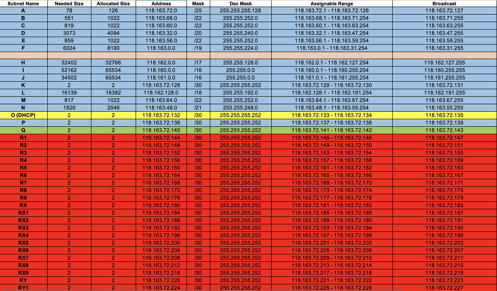
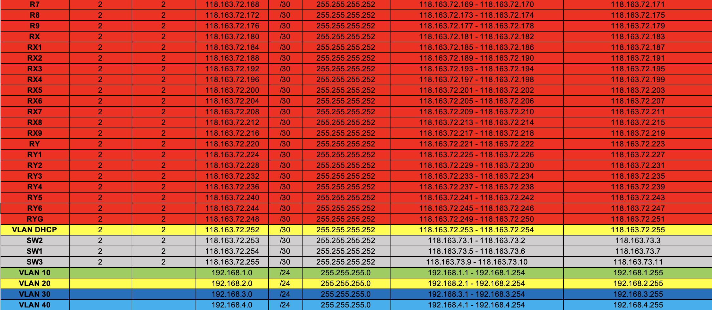

# Network-Configuration with various protocols for a business

- Following is the topology given

<h2>Solution</h2>

Identifying subnets

Assigning IP's to subnets.

Configured following protocols, RIP version 2, EIGRP, OSPF, redistribution, DHCP, VLSM, NAT, Access Control Lists.

The solution is file (pkt) is given above to check. Whole topology is working as required.
